# Ride

🚗 Pooling made easy. Submitted to MLH Hackthrob 2021.

# Inspiration

Our inspiration was about difficulties we faced as students and travel was always a big challenge. So we created a platform where users can carpool with strangers. We took great precautions in hiding the personal data of our users until a two-way connection has been established.

[Watch the video demo here](https://youtu.be/50CTwT4P6dY)

# How we built it

We built this product using node.js, express, CockroachDB, and React for the frontend.

# Challenges we ran into

CockroachDB was the biggest challenge as it was new for us.

# Accomplishments that we're proud of

The biggest accomplishment is the app is fully functional, and ready to use. We deployed the app on Heroku and Render.com servers. We feel the UI/UX aspect of the app turned out well.

# What we learned

CockroachDB on Clusters, Project Management.

# What's next for RIDE.

Chat and Mailing feature, notifications, mobile responsive layout, with PWA support.

# Screen Captures

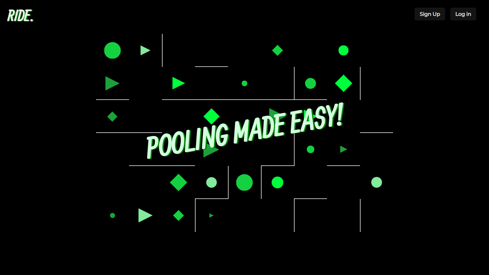
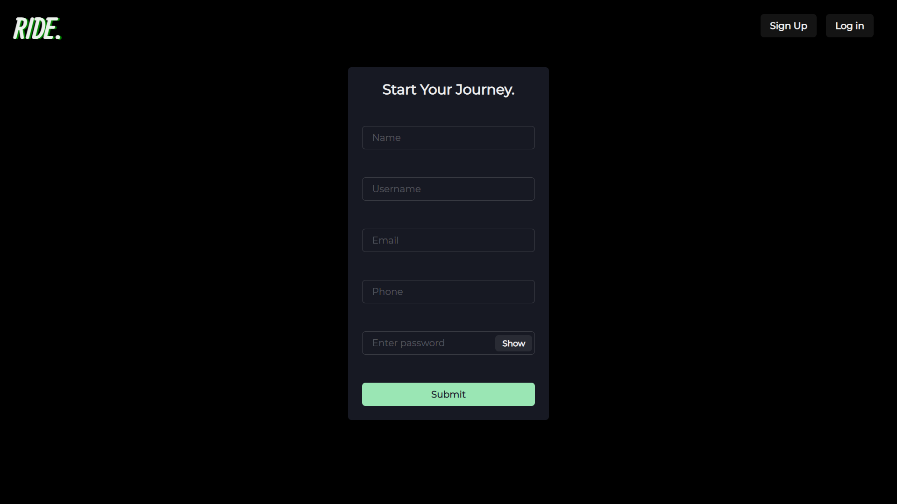
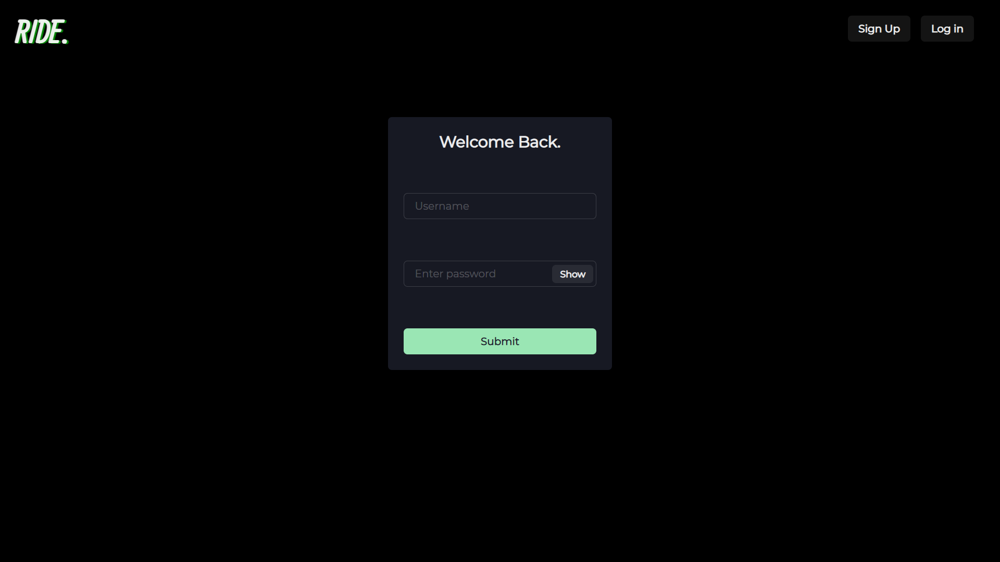
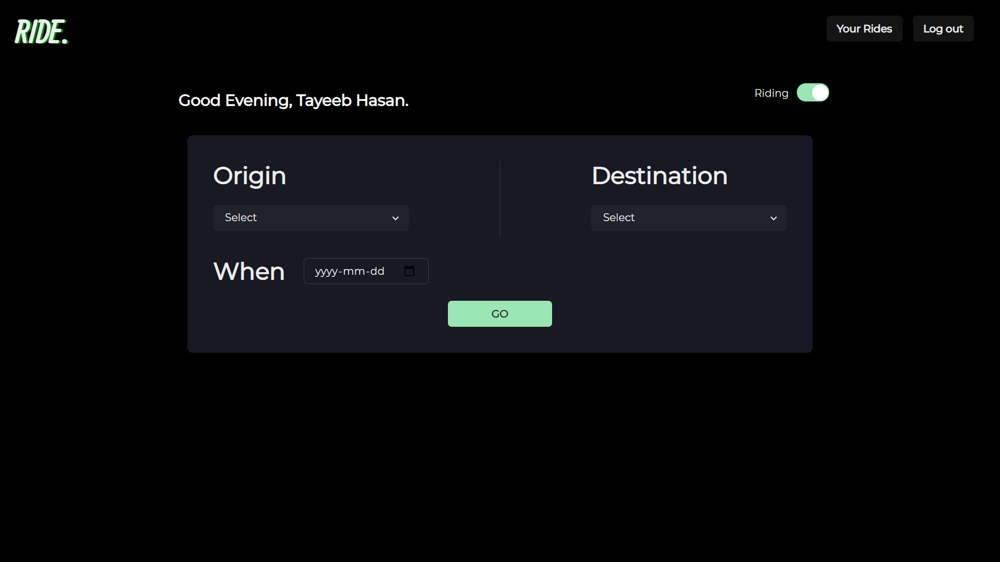
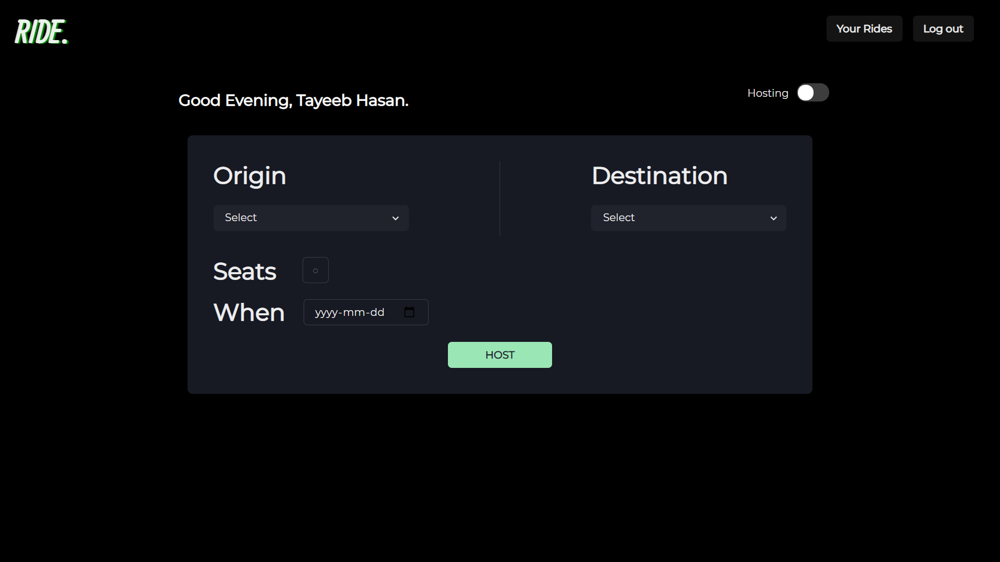
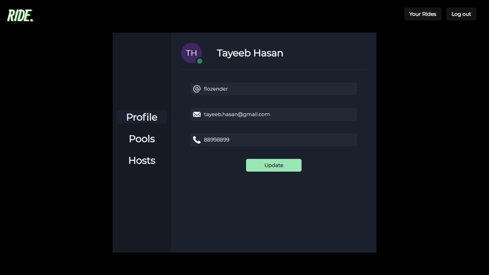
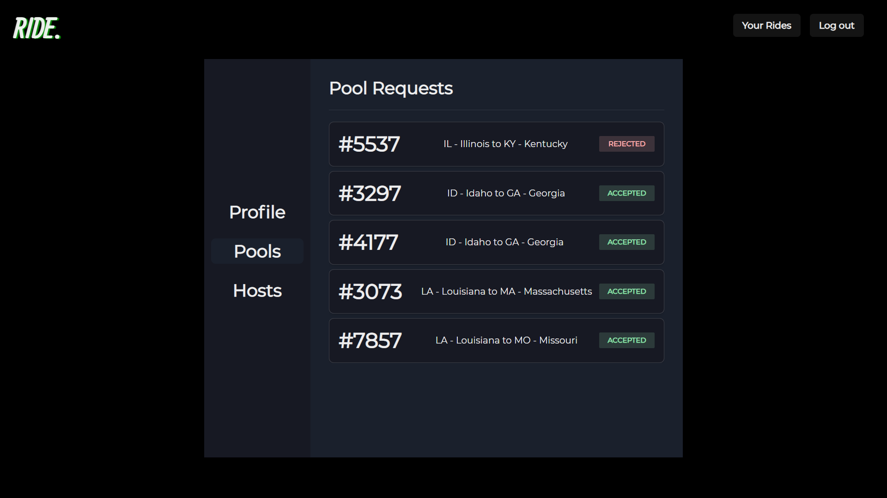
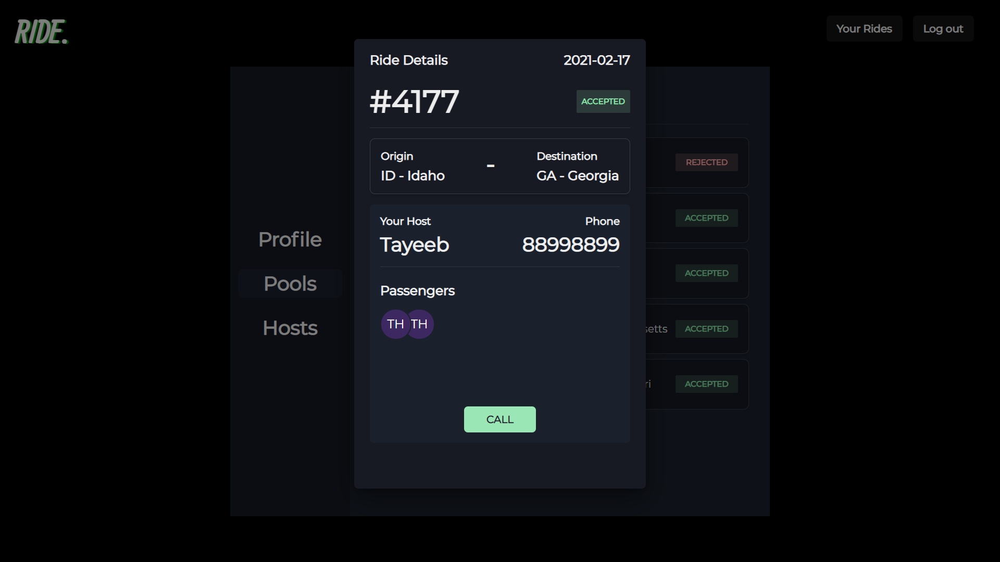
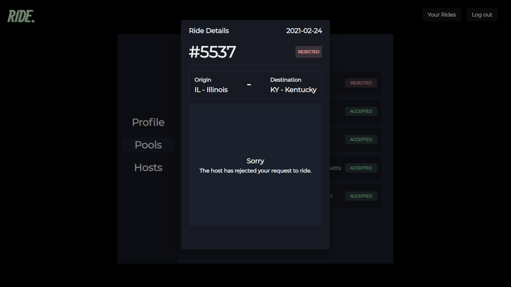
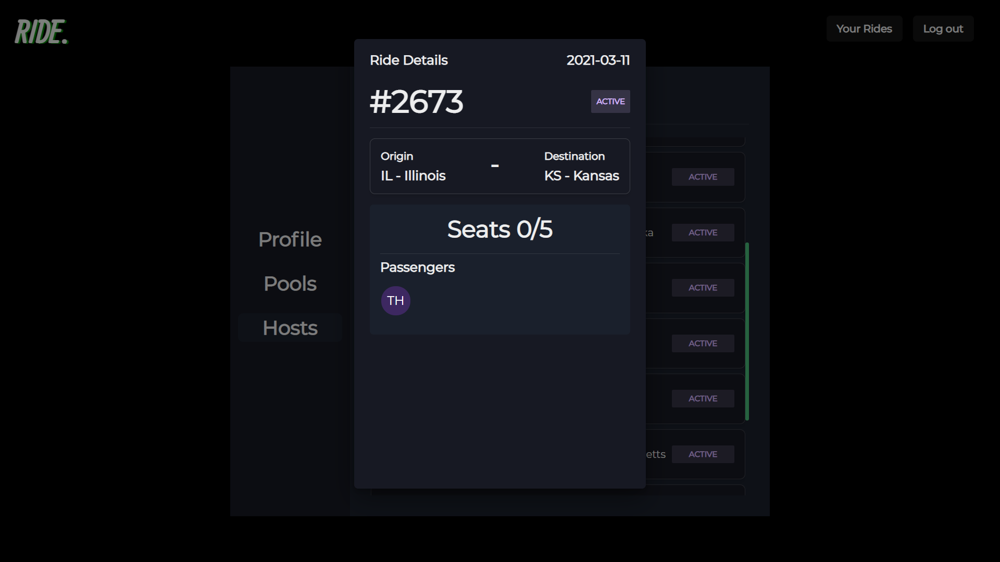
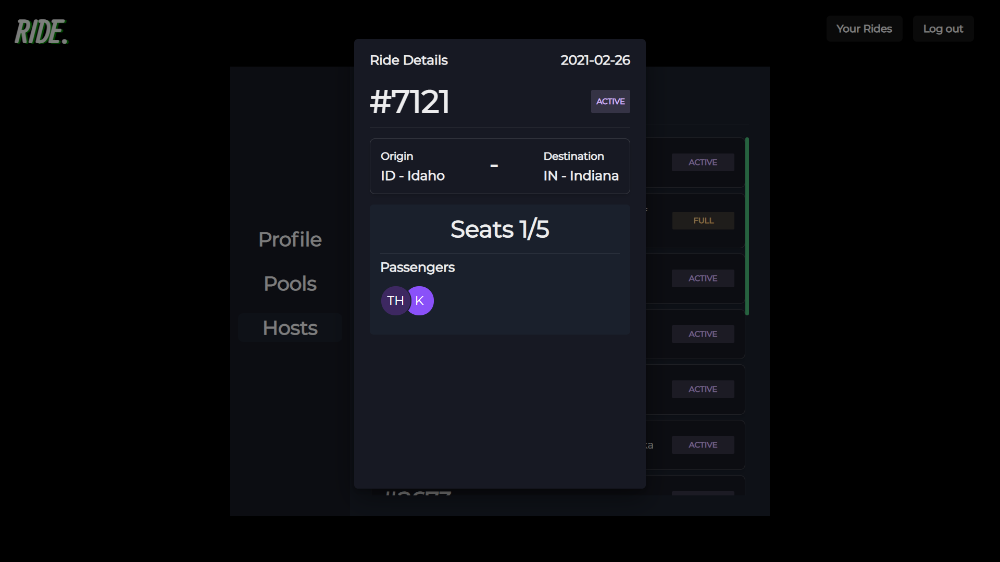
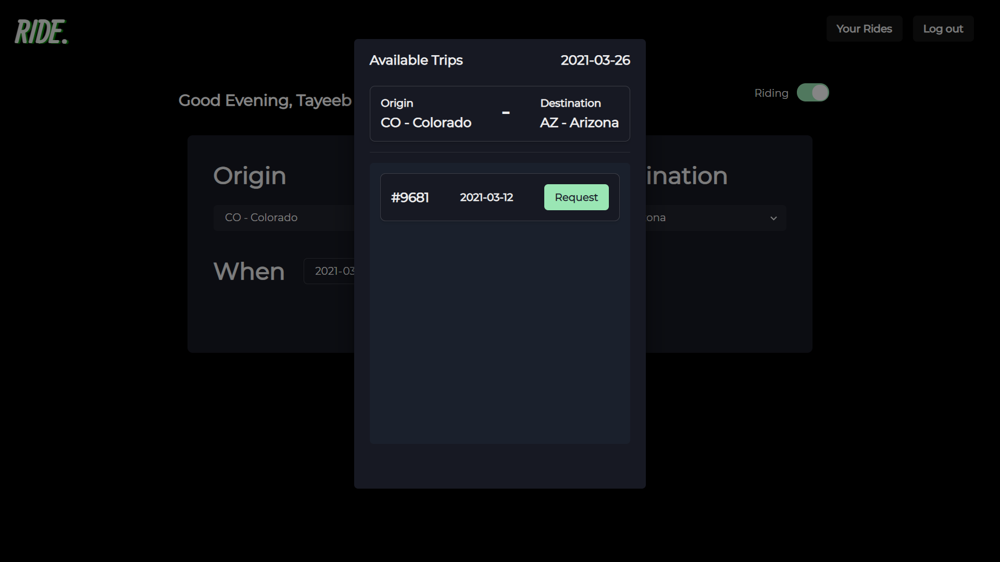
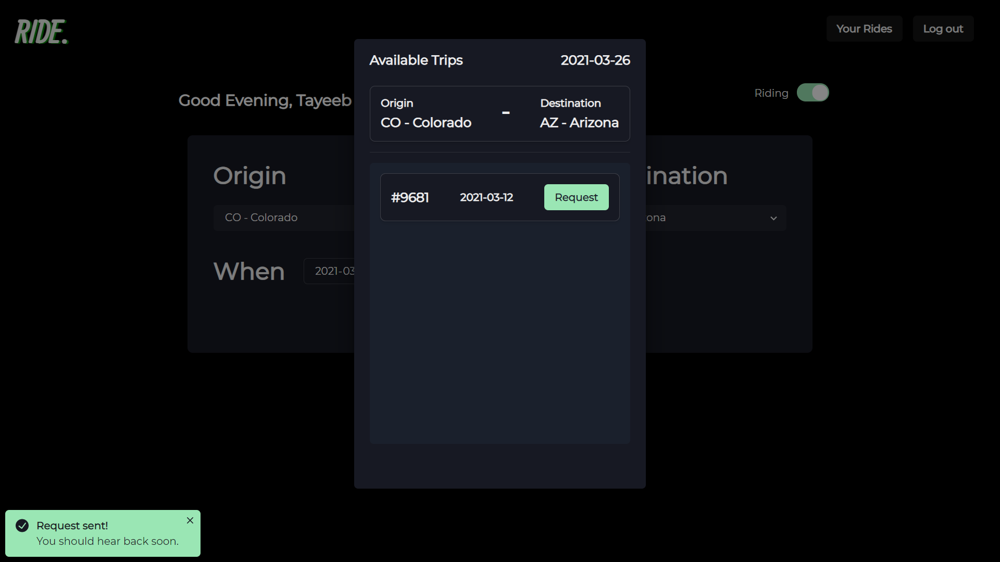
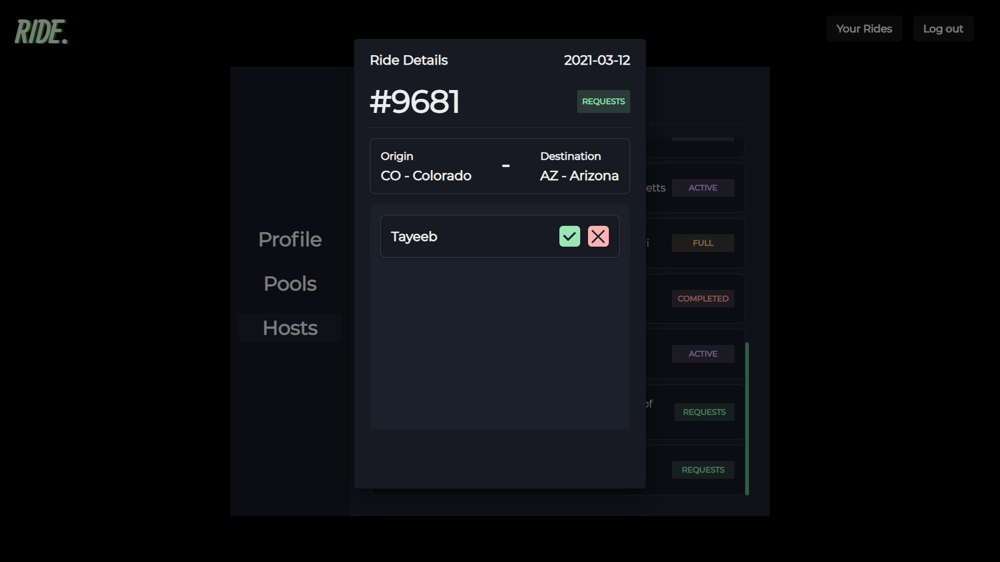
